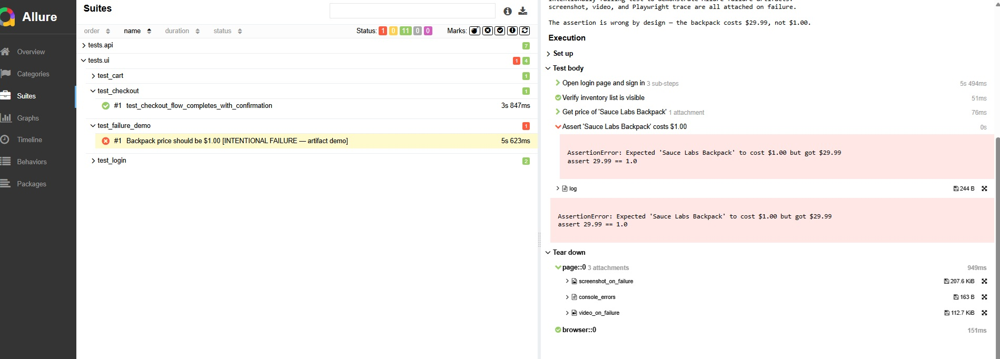

# QA Automation Assignment — Avi Cherny

> **Stack:** Python · Playwright · pytest
> **Targets:** [Swag Labs](https://www.saucedemo.com/) (UI) · [JSONPlaceholder](https://jsonplaceholder.typicode.com/) (API)
> **CI:** GitHub Actions — [](https://github.com/AviCherny/qa-automation-assignment-Avi-Cherny-Modelyo/actions/workflows/tests.yml)

---

## Prerequisites

- Python 3.11+
- pip

---

## Setup

```bash
git clone https://github.com/AviCherny/qa-automation-assignment-Avi-Cherny-Modelyo.git
cd qa-automation-assignment-Avi-Cherny-Modelyo

pip install -r requirements.txt
playwright install chromium
```

---

## Run Locally

**All tests:**
```bash
pytest
```

**UI tests only:**
```bash
pytest tests/ui/
```

**API tests only:**
```bash
pytest tests/api/
```

**Headed mode (watch the browser):**
```bash
HEADED=true pytest tests/ui/
```

---

## Run in Parallel

```bash
pytest -n 4
```

UI tests use isolated browser contexts per test — safe to parallelize with no shared state.

---

## Configuration

All config is read from environment variables. Defaults work out of the box.

| Variable | Default | Description |
|---|---|---|
| `BASE_URL` | `https://www.saucedemo.com` | Swag Labs base URL |
| `API_BASE_URL` | `https://jsonplaceholder.typicode.com` | JSONPlaceholder base URL |
| `BROWSER` | `chromium` | Browser engine (chromium / firefox / webkit) |
| `HEADED` | `false` | Run browser in headed mode |
| `TIMEOUT` | `10000` | Default element timeout (ms) |

---

## View Reports

After a test run, open the Allure report:

```bash
allure serve allure-results
```

### What you get on a failing test

Every failed UI test automatically attaches:
- **Screenshot** — browser state at the moment of failure
- **Video** — full recording of the test run
- **Playwright trace** — step-by-step DOM snapshots + network, viewable at [trace.playwright.dev](https://trace.playwright.dev)
- **Console errors** — any browser-side JS errors captured during the run



Trace files are saved to `traces/` and can also be opened directly:

```bash
playwright show-trace traces/<test-name>.zip
```

---

## CI Artifacts

Every GitHub Actions run uploads the full Allure results as an artifact.
Download from: **Actions tab → latest run → Artifacts → `allure-results`**

---

## Project Structure

```
.
├── tests/
│   ├── ui/
│   │   ├── test_login.py          # UI scenarios 1-2 (happy path + invalid credentials)
│   │   ├── test_cart.py           # UI scenario 3 (add to cart + verify state)
│   │   └── test_checkout.py       # UI scenario 4 (end-to-end checkout)
│   └── api/
│       ├── test_posts_get.py      # API scenarios 1-2 (GET /posts + GET /posts/{id})
│       └── test_posts_crud.py     # API scenarios 3-4 (POST + PUT/DELETE)
├── pages/                         # Page Object Model — no locators in test files
│   ├── login_page.py
│   ├── inventory_page.py
│   ├── cart_page.py
│   └── checkout_page.py
├── client/
│   └── api_client.py              # Thin API wrapper (base URL, headers, timeouts, retry)
├── config/
│   └── settings.py                # Centralised config from env vars
├── conftest.py                    # Shared fixtures (browser context, page, api_client)
├── pytest.ini                     # pytest + Playwright config, parallel workers
├── requirements.txt
├── DESIGN.md                      # Architecture decisions and tradeoff rationale
└── .github/
    └── workflows/
        └── tests.yml              # CI: install, run UI+API in parallel, upload artifacts
```

---

## Latest Green CI Run

[View on GitHub Actions](https://github.com/AviCherny/qa-automation-assignment-Avi-Cherny-Modelyo/actions)
